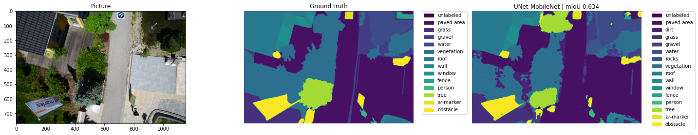

<h1>
deep-aerial
</h1>

> 👷🏻‍♂️°o(in progress)

# Results
semantic-drone-dataset

swimming-pool-detection-in-satellite-images

hituav

---
# Interesting datasets

- Kaggle

| kaggle API name | size | kaggle link|
|---|---|---|
| bulentsiyah/semantic-drone-dataset | 4Gb | [link](https://www.kaggle.com/datasets/bulentsiyah/semantic-drone-dataset) |
| usharengaraju/isaid-dataset | 7Gb | [link](https://www.kaggle.com/datasets/usharengaraju/isaid-dataset) |
|chandlertimm/dota-data | 20 Gb | [link](https://www.kaggle.com/datasets/chandlertimm/dota-data)
| pandrii000/hituav-a-highaltitude-infrared-thermal-dataset| 200 Mb |[link](https://www.kaggle.com/datasets/pandrii000/hituav-a-highaltitude-infrared-thermal-dataset)
| santurini/fits-images-for-object-counting-and-detection| 1 Gb |[link](https://www.kaggle.com/datasets/santurini/fits-images-for-object-counting-and-detection)
|rhammell/planesnet| 93 Mb | [link](https://www.kaggle.com/datasets/rhammell/planesnet)
|lincolnzh/martianlunar-crater-detection-dataset| 78Mb |[link](https://www.kaggle.com/datasets/lincolnzh/martianlunar-crater-detection-dataset)
|cici118/swimming-pool-detection-in-satellite-images| 84 Mb |[link](https://www.kaggle.com/datasets/cici118/swimming-pool-detection-in-satellite-images)
|kbhartiya83/swimming-pool-and-car-detection| 117 Mb |[link](https://www.kaggle.com/datasets/kbhartiya83/swimming-pool-and-car-detection)
|lilitopia/swimship-wake-imagery-mass| 12 Gb |[link](https://www.kaggle.com/datasets/lilitopia/swimship-wake-imagery-mass)
|smedegaard/satellite-water-yolo| 2 Mb |[link](https://www.kaggle.com/datasets/smedegaard/satellite-water-yolo?select=labels_satellite-water-yolo_2021-03-30-08-46-04)
|sadhliroomyprime/spatial-vehicle-detection| 62 Mb |[link](https://www.kaggle.com/datasets/sadhliroomyprime/spatial-vehicle-detection)
|tekbahadurkshetri/building-mapping| 4 Mb |[link](https://www.kaggle.com/datasets/tekbahadurkshetri/building-mapping)
|braunge/aerial-view-car-detection-for-yolov5| 71 Mb |[link](https://www.kaggle.com/datasets/braunge/aerial-view-car-detection-for-yolov5)
|llpukojluct/aerial-vehicle-detection-dataset| 2 Gb |[link](https://www.kaggle.com/datasets/llpukojluct/aerial-vehicle-detection-dataset)
|isaienkov/deforestation-in-ukraine| 35 Gb |[link](https://www.kaggle.com/datasets/isaienkov/deforestation-in-ukraine)
|kmader/aerial-change-detection-in-video-games| 3 Gb |[link](https://www.kaggle.com/datasets/kmader/aerial-change-detection-in-video-games)
|pear2jam/cars-drone-detection| 40 Mb |[link](https://www.kaggle.com/datasets/pear2jam/cars-drone-detection)
|aninda/etci-2021-competition-on-flood-detection| 4 Gb |[link](https://www.kaggle.com/datasets/aninda/etci-2021-competition-on-flood-detection)
|ancaco12/aerial-satellite-images | 25 Mb |[link](https://www.kaggle.com/datasets/ancaco12/aerial-satellite-images)
|quadeer15sh/augmented-forest-segmentation| 181 Mb |[link](https://www.kaggle.com/datasets/quadeer15sh/augmented-forest-segmentation)

- other: Aerial

| name | size | url link|
|---|---|---|
| Inria Aerial Image Labeling Dataset |  | [link](https://project.inria.fr/aerialimagelabeling/) |
| Cars Overhead With Context |  | [link](https://gdo152.llnl.gov/cowc/) |
|  |  | [link]() |

- other: Satellite

| name | size | url link|
|---|---|---|
| spacenet |  | [link](https://spacenet.ai/datasets/) |
| satlas |  | [link](https://satlas.apps.allenai.org/) |
|  |  | [link]() |

- other: Space

| name | size | url link|
|---|---|---|
| The PANGAEA mineralogical database | 13 MB | [link](https://data.mendeley.com/datasets/6dfkgnh9bp) |
|  |  | [link]() |
